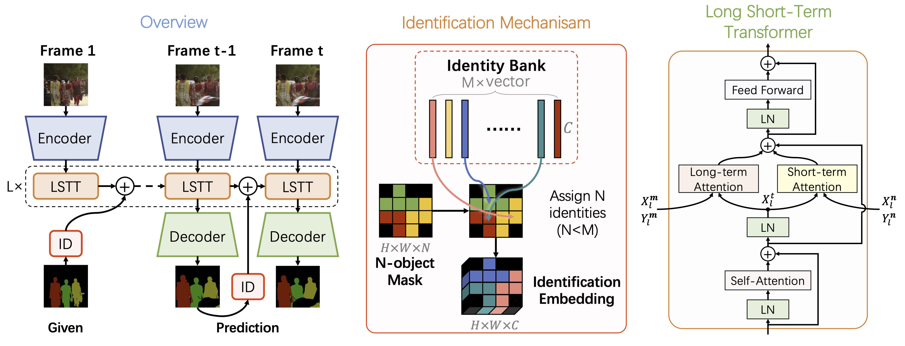

# AOT: Associating Objects with Transformers for Video Object Segmentation
This project is used to update news related to AOT ([NeurIPS 2021](https://arxiv.org/abs/2106.02638)), a highly effective and efficient VOS (video object segmentation) framework.

In AOT, we propose an identification mechanism, which enables us to model, propogate, and segment multiple objects as efficiently as processing a single object. Based on the identification mechanism, the AOT framework is lightweight (with less than 10M parameters in default) yet powerful (achieving SOTA performance). Besides, we propose Long Short-Term Transformer (LSTT) for propogating temporal information hierachically, and the balance of performance and efficiency is convenient by adding or reducing LSTT blocks now in VOS.

## News

- `2021/10`: The conference [paper](https://arxiv.org/abs/2106.02638) has been accepted by NeurIPS 2021 (score 8/8/7/8, [OpenReview](https://openreview.net/forum?id=hl3v8io3ZYt)).

- `2021/05`: We ranked 1st in the Track 1 (Video Object Segmentation) of the 3rd Large-scale Video Object Segmentation Challenge.

## Codebase

1. PaddlePaddle
        
    We are preparing an official PaddlePaddle implementation.

2. PyTorch (third-party)
        
    - [AOT-Benchmark](https://github.com/yoxu515/aot-benchmark) from ZJU. Thanks for such an excellent implementation.

