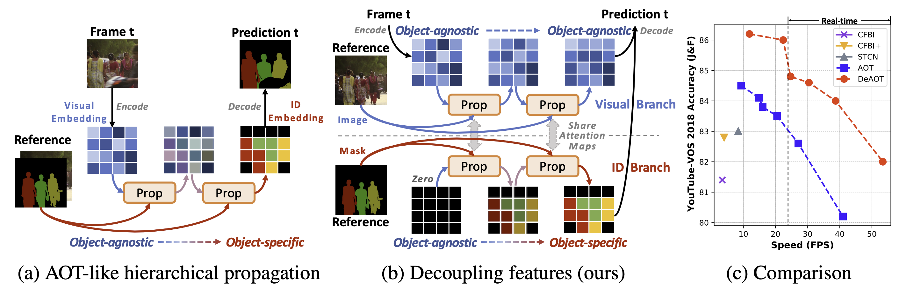
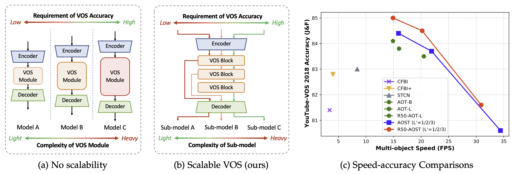

# AOT: Associating Objects with Transformers for Video Object Segmentation


[](https://paperswithcode.com/sota/video-object-segmentation-on-youtube-vos?p=associating-objects-with-scalable)
[](https://paperswithcode.com/sota/semi-supervised-video-object-segmentation-on-5?p=associating-objects-with-scalable)
[](https://paperswithcode.com/sota/visual-object-tracking-on-davis-2017?p=associating-objects-with-scalable)
[](https://paperswithcode.com/sota/semi-supervised-video-object-segmentation-on-1?p=associating-objects-with-scalable)
[](https://paperswithcode.com/sota/visual-object-tracking-on-davis-2016?p=associating-objects-with-scalable)

This project is used to update news related to AOT series frameworks ([NeurIPS 2021 (AOT)](https://arxiv.org/abs/2106.02638), [NeurIPS 2022 (DeAOT, Spotlight)](https://arxiv.org/abs/2210.09782)), a highly effective and efficient VOS (video object segmentation) framework.

## Implementations and Results
The implementations of AOT can be found below:

1. PyTorch
        
    - [AOT-Benchmark](https://github.com/yoxu515/aot-benchmark) from ZJU, which **supports both AOT and DeAOT now**. Thanks for such an excellent implementation.
    
2. PaddlePaddle
        
    We are preparing an official PaddlePaddle implementation.
    
## News
- `2022/10`: **WINNER** - AOT-based Tracker ranked **1st** in **four tracks** of the **VOT 2022** challenge ([presentation of results](https://data.votchallenge.net/vot2022/vot2022_st_rt.pdf)). In detail, our MS-AOT is the winner of two segmentation tracks, VOT-STs2022 and VOT-RTs2022 (real-time). In addition, the bounding box results of MS-AOT (initialized by [AlphaRef](https://github.com/MasterBin-IIAU/AlphaRefine), and output is bounding box fitted to mask prediction) surpass the winners of two bounding box tracks, VOT-STb2022 and VOT-RTb2022 (real-time). The bounding box results were required by the organizers after the competition deadline but were highlighted in the [workshop presentation](https://data.votchallenge.net/vot2022/vot2022_st_rt.pdf) (ECCV 2022).

- `2022/10`: An improved version of AOT, [DeAOT](https://arxiv.org/abs/2210.09782) (Decoupling Features in Hierarchical Propagation for Video Object Segmentation), has been accepted by NeurIPS 2022 (Spotlight). DeAOT achieves state-of-the-art accuracy and efficiency on VOS/VOT benchmarks, including YouTube-VOS 2018/2019, DAVIS 2016/2017, and VOT 2020.

- `2022/03`: An extension of AOT, [AOST](https://arxiv.org/abs/2203.11442) (under review), is available now. AOST is a more robust and flexible framework, supporting run-time speed-accuracy trade-offs.

- `2021/10`: The conference [paper](https://arxiv.org/abs/2106.02638) has been accepted by NeurIPS 2021 (score 8/8/7/8, [OpenReview](https://openreview.net/forum?id=hl3v8io3ZYt)).

- `2021/05`: **WINNER** - We ranked **1st** in the Track 1 (Video Object Segmentation) of the 3rd Large-scale Video Object Segmentation Challenge.

## About DeAOT


Although AOT successfully introduces the hierarchical propagation into VOS, the hierarchical propagation can gradually propagate information from past frames to the current frame and transfer the current frame feature from object-agnostic to object-specific, and the increase of object-specific information will inevitably lead to the loss of object-agnostic visual information in deep propagation layers. To solve such a problem and further facilitate the learning of visual embeddings, we propose a Decoupling Features in Hierarchical Propagation (DeAOT) approach to decouple the hierarchical propagation of object-agnostic and object-specific embeddings by handling them in two independent branches. Besides, to compensate for the additional computation from dual-branch propagation, we propose an efficient module for constructing hierarchical propagation, Gated Propagation Module.

## About AOST

previous methods always have static network architectures, which are not flexible enough to adapt to different speed-accuracy requirements. To solve the above problems, we proposed an Associating Objects with Scalable Transformers (AOST) approach to match and segment multiple objects collaboratively with online network scalability. In AOST, a Scalable Long Short-Term Transformer (S-LSTT) is designed to construct hierarchical multi-object associations and enable online adaptation of accuracy-efficiency trade-offs. By further introducing scalable supervision and layer-wise ID-based attention, AOST is not only more flexible but more robust than previous methods.

## About AOT


In AOT, we propose an identification mechanism, which enables us to model, propogate, and segment multiple objects as efficiently as processing a single object. Based on the identification mechanism, the AOT framework is lightweight (with less than 10M parameters in default) yet powerful (achieving SOTA performance). Besides, we propose Long Short-Term Transformer (LSTT) for propogating temporal information hierachically, and the balance of performance and efficiency is convenient by adding or reducing LSTT blocks now in VOS.

## Citations
Please consider citing the related paper(s) in your publications if it helps your research.
```
@inproceedings{yang2022deaot,
  title={Decoupling Features in Hierarchical Propagation for Video Object Segmentation},
  author={Yang, Zongxin and Yang, Yi},
  booktitle={Advances in Neural Information Processing Systems (NeurIPS)},
  year={2022}
}
@article{yang2021aost,
  title={Associating Objects with Scalable Transformers for Video Object Segmentation},
  author={Yang, Zongxin and Miao, Jiaxu and Wang, Xiaohan and Wei, Yunchao and Yang, Yi},
  journal={arXiv preprint arXiv:2203.11442},
  year={2022}
}
@inproceedings{yang2021aot,
  title={Associating Objects with Transformers for Video Object Segmentation},
  author={Yang, Zongxin and Wei, Yunchao and Yang, Yi},
  booktitle={Advances in Neural Information Processing Systems (NeurIPS)},
  year={2021}
}
```


